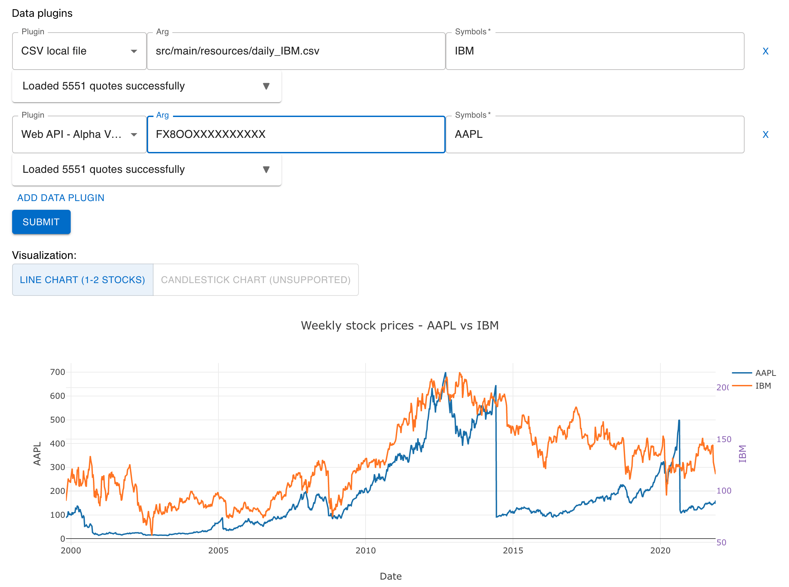

# Stock Price Analytic Framework

## Get Started
This project is using Spring Boot as backend and React as the frontend.
### Backend
Install the game and run the backend on localhost:8080.
```commandline
mvn clean install
mvn spring-boot:run
```

### Frontend
Change directory to the frontend and start the React on <http://localhost:3000/>.

```commandline
cd frontend
npm install
npm start
```


## Idea
The idea is to provide an analytics framework for users to analyze stock prices through data retrieval, processing and visualization.

By providing data plugins and visualization plugins interfaces, we allow users to retrieve stock quotes from different sources (provided by data plugins) and shows different results in different ways (provided by the visualization plugins).

In addition, the framework performs data processing that includes merging stock quotes from different data sources and aggregating them by different time period.

## How to use the GUI
1. Select data plugins

   **[ADDED DATA PLUGINS]**
   1. the TXT local file plugin
      1. the path to the *.txt file should be entered in the `arg` field, and should follow the format of the example *.txt file
         1. sample *.txt file: `src/main/resources/daily_uniqlo.txt`

         [Note: closeAdj, volume, closeUSD are ignored in plugin implementation.]
      2. the symbols to extract should be entered in the `symbol` field
         1. sample symbol: "HSI"
   2. the JSON local file plugin
      1. the path to the *.json file should be entered in the `arg` field, and should follow the form of the example *.json file
         1. sample *.json file: `src/main/resources/bitcoin.json`
      2. the symbols to extract should be entered in the `symbol` field
         1. sample symbol: "BTC"
   3. the Market Stack web API plugin
      1. users should register for a free API key from the webpage, then enter the API key in the `arg` field
      2. the `symbol` field can contain any combination of "IBM", "AAPL", "NKE"

   **[ORIGINAL]**
   1. For CSV local file plugin, the path to csv file should be provided in the `arg` field, and the file follow the format in [src/main/resources/daily_IBM.csv](src/test/resources/all.csv)  (note: volume column in the file is ignored in the plugin)
   2. For the Alpha vantage plugin, you should register for a free API key from the web page, and paste the key in the `Arg` field


2. Add the symbols that you want to extract in the Symbols field, separated by comma if multiple symbols are needed
3. Press submit
4. Select the visualization plugin you want

   **[ADDED VISUALIZATION PLUGINS]**
   1. The filled chart supports only 1 stock, and uses daily data
   2. The bar chart supports only 1 stock, and uses monthly data

   **[ORIGINAL]**
   1. The candlestick chart supports only 1 stock, and uses daily data
   2. The line chart supports 1 or 2 stocks, and uses the aggregated weekly data

Example:


## How to extend
Both data plugins and visualization plugins can be extended.

To extend the data plugins, implement the `DataPlugin` interface and add the class name into `src/main/resources/META-INT/services/deadlinefighters.analyticsframework.framework.core.DataPlugin`.

To extend the data plugins, implement the `VisualizationPlugin` interface and add the class name into the according file under `src/main/resources/META-INT/services/deadlinefighters.analyticsframework.framework.core.VisualizationPlugin`.

Data plugins could provide *a list of stock prices with symbol, open price, close price, high price, low price, date*.

Data plugins:
- **(Done)** Local file (e.g. csv)
- **(Done)** Web APIs. Free time series stock API like [Alpha vantage](https://www.alphavantage.co/).
- Database

Visualization plugins:

*[Plotly](https://plotly.com/) is used in this framework for visualization plugins.*
- **(Done)** Candlestick chart displaying the open, close, high, low price for a specific symbol during a time period.
- **(Done)** Line chart displaying stock comparison between 2+ stocks.
- Bubble chart displaying changes to different stocks within a specific time period.
- Bar chart displaying changes to different stocks in a single day


